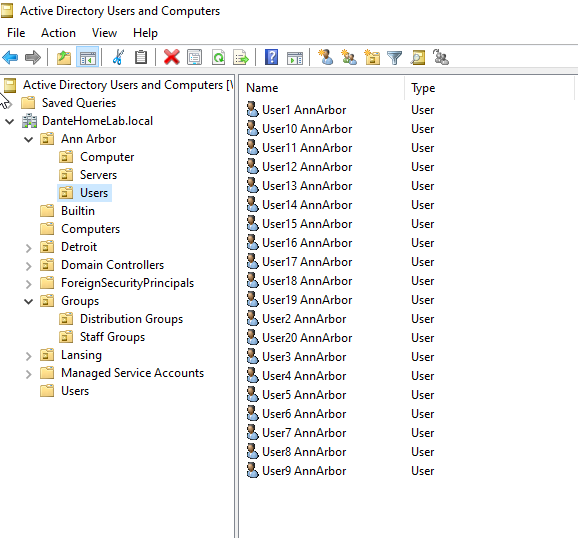

# IT-Helpdesk-Level-1-Lab

# DanteHomeLab Active Directory & Helpdesk Simulation

This project simulates a realistic Company's Active Directory (AD) environment for hands-on IT support training and documentation. Built entirely within a Windows Server 2022 VM, this lab models a fictional company, "DanteHomeLab.local," with city-based office branches, departments, user accounts, and group management.

---

## Project Scope

### Domain
- **Name:** `DanteHomeLab.local`
- **Server:** Windows Server 2022 (VMware Workstation)
- **Clients:** (Planned) Windows 10/11 domain-joined VMs

---
<br>

# ***🔥Objective 1)  Set up any Organizational Units (OUs) and Groups*** 

<br>
<br>

### 🗂️ Organizational Unit Structure

```
DanteHomeLab.local
├── Ann Arbor
│   ├── Users
│   ├── Computers
│   └── Servers
├── Detroit
│   ├── Users
│   ├── Computers
│   └── Servers
├── Lansing
│   ├── Users
│   ├── Computers
│   └── Servers
└── Groups
    ├── Staff Groups (Security)
    └── Distribution Groups
```

Each city contains 20 employees spread across 5 departments (60 total employees throughout the company):  
**Accounting, HR, IT, Management, Sales**
Here is an example of what the city branches' users OU looks like:


---

## 🔐 Group Management

### Security Groups
- Type: **Global**
- Purpose: File access, permissions, GPO targeting
- Naming:
  - `Detroit_IT`
  - `AllStaff`
  - `Lansing_Accounting`
  - etc.

### Distribution Groups
- Type: **Universal**
- Purpose: Email/announcements (Exchange-compatible)
- Naming:
  - `Detroit_IT_DG`
  - `AllStaff_DG`
  - `Ann Arbor_HR_DG`

---

## ⚙️ Automation via PowerShell

All users and groups were created via scripted automation. Only the initial Active Directory setup was manual. All scripts and their purposes are outlined below:

### Creates 20 users per city (Detroit, Lansing, Ann Arbor) inside each city's Users OU under the DanteHomeLab.local domain:
```powershell
Import-Module ActiveDirectory

$domain = "DanteHomeLab.local"
$domainDN = "DC=DanteHomeLab,DC=local"
$cities = @("Detroit", "Lansing", "Ann Arbor")

foreach ($city in $cities) {
    for ($i = 1; $i -le 20; $i++) {
        $firstName = "User$($i)"
        $cityNoSpace = $city -replace ' ', ''
        $lastName = $cityNoSpace
        $username = "$firstName$lastName"
        $userDN = "OU=Users,OU=$city,$domainDN"
        $UPN = "$username@$domain"
        $password = ConvertTo-SecureString "P@ssword123" -AsPlainText -Force

        if (-not (Get-ADUser -Filter { SamAccountName -eq $username } -ErrorAction SilentlyContinue)) {
            New-ADUser -Name "$firstName $lastName" `
                       -GivenName $firstName `
                       -Surname $lastName `
                       -SamAccountName $username `
                       -UserPrincipalName $UPN `
                       -Path $userDN `
                       -AccountPassword $password `
                       -Enabled $true `
                       -PasswordNeverExpires $true `
                       -ChangePasswordAtLogon $false
        }
    }
}
```
---

### Creates Staff Groups and Distribution Groups OUs, then adds global groups for departments and cities under each:
```powershell
$domainDN = "DC=DanteHomeLab,DC=local"
$cities = @("Detroit", "Lansing", "Ann Arbor")
$departments = @("IT", "Accounting", "HR", "Sales", "Management")

$cityGroups = @()
foreach ($city in $cities) { $cityGroups += "${city}_Staff" }

$globalGroups = @("AllStaff") + $cityGroups + $departments
$cityGroupsDist = $globalGroups | ForEach-Object { "${_}_DG" }

# Create OUs
$ouPaths = @(
    "OU=Groups,$domainDN",
    "OU=Staff Groups,OU=Groups,$domainDN",
    "OU=Distribution Groups,OU=Groups,$domainDN"
)
foreach ($ou in $ouPaths) {
    if (-not (Get-ADOrganizationalUnit -Filter "DistinguishedName -eq '$ou'" -ErrorAction SilentlyContinue)) {
        New-ADOrganizationalUnit -Name (($ou -split ',')[0] -replace '^OU=', '') -Path (($ou -replace '^OU=.*?,') -join ',' )
    }
}

# Create groups in respective OUs
foreach ($group in $globalGroups) {
    if (-not (Get-ADGroup -Filter { Name -eq $group } -ErrorAction SilentlyContinue)) {
        New-ADGroup -Name $group -GroupScope Global -GroupCategory Security -Path "OU=Staff Groups,OU=Groups,$domainDN"
    }
}
foreach ($dg in $cityGroupsDist) {
    if (-not (Get-ADGroup -Filter { Name -eq $dg } -ErrorAction SilentlyContinue)) {
        New-ADGroup -Name $dg -GroupScope Universal -GroupCategory Distribution -Path "OU=Distribution Groups,OU=Groups,$domainDN"
    }
}
```
---

### Adds new department-based groups per city (e.g., Detroit_IT, Lansing_HR) for both Security and Distribution categories:
```powershell
foreach ($city in $cities) {
    foreach ($dept in $departments) {
        $secGroup = "${city}_${dept}"
        $distGroup = "${secGroup}_DG"

        if (-not (Get-ADGroup -Filter { Name -eq $secGroup } -ErrorAction SilentlyContinue)) {
            New-ADGroup -Name $secGroup -GroupScope Global -GroupCategory Security -Path "OU=Staff Groups,OU=Groups,$domainDN"
        }

        if (-not (Get-ADGroup -Filter { Name -eq $distGroup } -ErrorAction SilentlyContinue)) {
            New-ADGroup -Name $distGroup -GroupScope Universal -GroupCategory Distribution -Path "OU=Distribution Groups,OU=Groups,$domainDN"
        }
    }
}
```
---

### Add each user to: Global groups (AllStaff, IT, etc.); City groups (Detroit_Staff, Ann Arbor_Staff); City-specific department groups (Lansing_HR); Their Distribution group equivalents; Also exports a CSV report of group memberships
```powershell
$report = @()

foreach ($city in $cities) {
    $userOU = "OU=Users,OU=$city,$domainDN"
    $users = Get-ADUser -SearchBase $userOU -Filter * 

    $counter = 0
    foreach ($user in $users) {
        $username = $user.SamAccountName
        $deptIndex = [math]::Floor($counter / 4)
        if ($deptIndex -ge $departments.Count) { $deptIndex = $departments.Count - 1 }
        $dept = $departments[$deptIndex]

        $groupsToAdd = @(
            "AllStaff", "AllStaff_DG",
            "${city}_Staff", "${city}_Staff_DG",
            $dept, "${dept}_DG",
            "${city}_${dept}", "${city}_${dept}_DG"
        )
        foreach ($group in $groupsToAdd) {
            Add-ADGroupMember -Identity $group -Members $username
        }

        $report += [pscustomobject]@{
            Username           = $username
            City               = $city
            Department         = $dept
            SecurityGroups     = "$($groupsToAdd | Where-Object { $_ -notlike '*_DG' } -join ', ')"
            DistributionGroups = "$($groupsToAdd | Where-Object { $_ -like '*_DG' } -join ', ')"
        }

        $counter++
    }
}
$report | Export-Csv -Path "C:\AD_Group_Assignments_Report.csv" -NoTypeInformation -Encoding UTF8
```
---
<br>

# ***🔥Objective 2) Implement Group Policy Objects*** 

<br>
<br>


